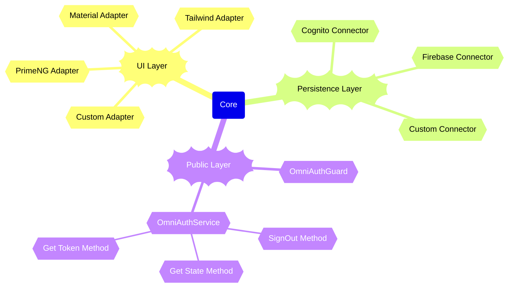

# Authentication for Angular applications

### General architecture overview for OmniAuth




This project provides a set of Angular packages to implement authentication in your Angular applications. It is designed to be modular and extensible, allowing you to choose the UI and backend connector that best fits your needs.

- @ngx-tools/auth-core
- @ngx-tools/auth-ui-material
- @ngx-tools/auth-connector-aws-cognito
- ...

### Supported features

# UI Material Adapter:

| Feature                        | Cognito | Firebase |
|--------------------------------|:-------:|:--------:|
| Login / With Email/Password    |    ✅    |    🔜    |
| Login / With Username/Password |   🔜    |    🔜    |
| Login / Passwordless           |   🔜    |    🔜    |
| Login / Using google           |    ✅    |    🔜    |
| Login / Using facebook         |   🔜    |    🔜    |
| Login / Using microsoft        |   🔜    |    🔜    |
| Login / Using apple            |   🔜    |    🔜    |
| Login / Using github           |   🔜    |    🔜    |
| Login / Using custom provider  |   🔜    |    🔜    |
| Register                       |    ✅    |    🔜    |
| Register / custom attributes   |    ✅    |    🔜    |
| Register / marketing consent   |    ✅    |    🔜    |
| Register / marketing consent   |    ✅    |    🔜    |
| Forget password                |    ✅    |    🔜    |
| Reset password                 |    ✅    |    🔜    |
| Authorized welcome page        |    ✅    |    🔜    |
| Sign Out feature               |    ✅    |    🔜    |
| Validation                     |    ✅    |    🔜    |
| Error Handling                 |    ✅    |    🔜    |

✅ Done
❌ Not possible
🔜 Planned


### Installation


1. Install the core package:

```bash
  pnpm install @ngx-tools/auth-core
```

2. Install the UI adapter package:

```bash
  pnpm install @ngx-tools/auth-ui-material
```

3. Install the connector package:

```bash
  pnpm install @ngx-tools/auth-connector-aws-cognito
```

4. Configuration

4.1 Configure core and selected connector

```typescript
export const appConfig: ApplicationConfig = {
  providers: [
    //...
    configureAuth({
      authService: AuthAwsCognitoService,
    }),
    configureAuthCognitoConnector({
      // see interface for details
      cognito: environment.cognito
    })
    //...
  ],
};
```

  4.2 Use selected UI adapter
```angular2html

<omni-auth-ui-mat
  [config]="{
    signUp: {
      additionalAttributes: [
          {
           key: 'newsletterConsent',
           type: 'checkbox',
           isRequired: true,
           label: 'Subscribe to our newsletter',
         }
       ]
      }
    }"
>
  <p sign-up-footer>
    By signing up, you agree to our <a class="link" tabindex="0">terms and conditions</a>
  </p>
</omni-auth-ui-mat>
```
