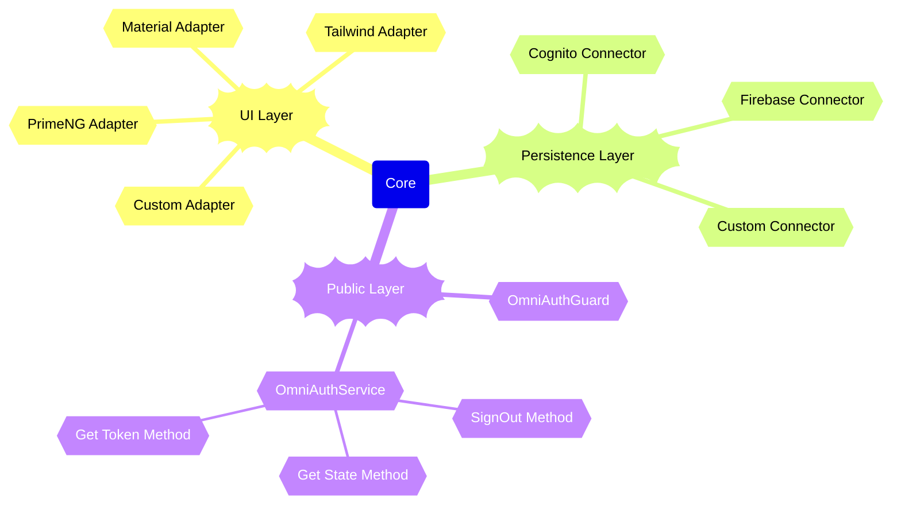

# @ngx-addons/omni-auth-core

A comprehensive Angular authentication library providing core functionality for authentication flows, guards, and error handling.

## Features

- **Authentication Guards**: Route protection with built-in auth guards
- **Error Handling**: Comprehensive error collection and messaging system
- **Routing Services**: Authentication-aware routing utilities
- **Type Safety**: Full TypeScript support with well-defined interfaces
- **Configurable**: Flexible configuration system with default patterns
- **Zoneless**: Designed to work without Angular's NgZone for performance optimization
- **UI Agnostic**: Compatible with various UI libraries (Material, Tailwind, PrimeNG, etc.)
- **Persistence Layer**: Supports multiple authentication backends (Cognito, Firebase, etc.)

## General architecture overview for OmniAuth



## Installation

```bash
npm install @ngx-addons/omni-auth-core
```

```bash
pnpm add @ngx-addons/omni-auth-core
```

```bash
yarn install @ngx-addons/omni-auth-core
```

## Quick Start

### 1. Configure Authentication

The library includes default configurations and patterns that can be customized to fit your application's needs.

```typescript
import {configureAuth} from '@ngx-addons/omni-auth-core';


configureAuth({
    authService: AuthAwsCognitoService, // configure connector package (see below)
    bearerAuthentication: {
      whitelistedEndpoints: [environment.apiUrl],
    },
    routing: {
      secured: ['/', 'protected'],
      guest: ['/'],
    },
  }
);
```

### 2. Install the connector package:

Connectors are responsible for integrating with different authentication backends. Currently, we support AWS Cognito. Here is the list of available connectors:

| Connector Name | Status | Package                               |
|----------------|:------:|:--------------------------------------|
| Cognito        |   ✅    | @ngx-addons/auth-connector-aws-cognito |
| Firebase       |   🔜   | 🔜                                    |

```bash
  pnpm install @ngx-addons/auth-connector-aws-cognito
```

You can also create your own custom connector by implementing the `OmniAuthService` interface.

### 3. Install the UI adapter package:
UI Adapters provide pre-built UI components for authentication flows. Currently, we support Material Design. Here is the list of available UI adapters:

```bash
  pnpm install @ngx-addons/auth-ui-material
```

| Connector Name | Status |           Package           |
|----------------|:------:|:---------------------------:|
| Cognito        |   ✅    | @ngx-addons/auth-ui-material |
| Firebase       |   🔜   |             🔜              |

You can also create your own custom UI adapter by using `OmniAuthService` interface.

### 4. Use Auth Guard

```typescript
import {onlyAuthenticated, onlyGuest} from '@ngx-addons/omni-auth-core';

const routes: Routes = [
  {
    path: 'protected',
    component: ProtectedComponent,
    canActivate: [onlyAuthenticated()],
  },
  {
    path: 'auth',
    component: AuthComponent,
    canActivate: [onlyGuest()],
  }
];

```

## TypeScript Support

Full TypeScript support with comprehensive interfaces and type definitions for a better development experience.

| Feature                        | Cognito | Firebase |
|--------------------------------|:-------:|:--------:|
| Login / With Email/Password    |    ✅    |    🔜    |
| Login / With Username/Password |   🔜    |    🔜    |
| Login / Passwordless           |   🔜    |    🔜    |
| Login / Using google           |    ✅    |    🔜    |
| Login / Using facebook         |   🔜    |    🔜    |
| Login / Using microsoft        |   🔜    |    🔜    |
| Login / Using apple            |   🔜    |    🔜    |
| Login / Using github           |   🔜    |    🔜    |
| Login / Using custom provider  |   🔜    |    🔜    |
| Register                       |    ✅    |    🔜    |
| Register / custom attributes   |    ✅    |    🔜    |
| Register / marketing consent   |    ✅    |    🔜    |
| Register / marketing consent   |    ✅    |    🔜    |
| Forget password                |    ✅    |    🔜    |
| Reset password                 |    ✅    |    🔜    |
| Authorized welcome page        |    ✅    |    🔜    |
| Sign Out feature               |    ✅    |    🔜    |
| Validation                     |    ✅    |    🔜    |
| Error Handling                 |    ✅    |    🔜    |

✅ Done
❌ Not possible
🔜 Planned

## License

See the [LICENSE](LICENSE.md) file for details.
